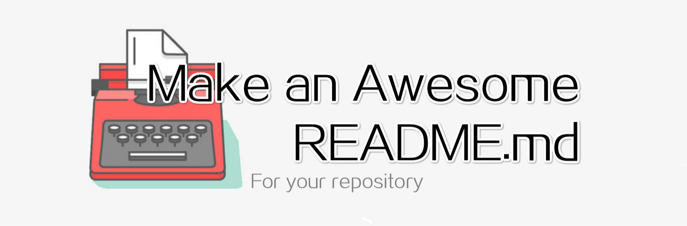

[](http://makeapullrequest.com)  

[Jump to the Content right now ↓](#Introduction)

## Foreword

**How to make an Awesome `README.md` for you repository.**

This document talks about the good way to make `README.md` file. It is written by [Eltrac Koalar](https://github.com/BigCoke233) originally. Any valuable Pull Requests and issue is welcome.

We need other editions of some other languages. If you're gald and able to do it, you can help us. And if you have some ideas, you can open an new issue.

Copyright &copy; 2020 Eltrac Koalar, All Rights Reserved.

## Contributors

| Contributor                                             | Contribution                                             |
| ------------------------------------------------------- | -------------------------------------------------------- |
| [Eltrac Koalar](https://github.com/BigCoke233) (author) | Write the origin English version, repository management. |

---

## Introduction

It's acknowledged that GitHub allows every repository to have a `README.md` file to show some information about it. But some people do badly in writting so that they can't write `README.md` well or even do not create it at all. It would cause some trouble to the users because the users may not know what the product is used for. Are you a member of them? This repository may help you make an awesome `README.md`.

## Table of Contents

- [What is an awesome `README.md`？](#introduction)
- [Markdown](#markdown)
- [An awesome header](#an-awesome-header)
- [GitHub Badges](#github-badges)
- [While writing the body of Contents](#while-writing-the-body-of-contents)
    - [What should be included?](#what-should-be-included)
    - [Title each part](#title-each-part) 
    - [Serious Grammar](#serious-grammar)
    - [Less uncommon words](#less-uncommon-words)
- [Copyright & Contributors](#copyright--contributors)
- [Awesome banners](#awesome-banners)
- [Emoji](#emoji)
- [Examples](#examples)

## What is an awesome `README.md`?

The first step of trying new things is always to know what it is. You've known what `README.md` is, it's a Markdown file which shows in the repository page directly to tell user what the repository it, what it can do for them and how to use it. 

But what is an **awesome** `README.md`？

Everything was created to do something. If it do it **well**, then it can be called awesome. So, if an `README.md` can make **any** users understand the repository or your product **totally**, including what it is, what it is used for, what it can do and how to use it, and the one who have read won't have trouble with the basic function of the product, the `README.md` can be called an awesome `README.md`.

## Markdown

All the `README.md` is based on Markdown. But what is Markdown?

> **Markdown** is a [lightweight markup language](https://en.wikipedia.org/wiki/Lightweight_markup_language) with plain-text-formatting syntax. Its design allows it to be converted to many output formats, but the original tool by the same name only supports [HTML](https://en.wikipedia.org/wiki/HTML).
>
> —— Wikipedia

So you must write `README.md` with Markdown. If you don't know Markdown, there links below might help you. You can learn Markdown with one of them.

- [markdown-cheatsheet](https://github.com/tchapi/markdown-cheatsheet)（English）
- [markdown](https://github.com/GitbookIO/markdown)（English）

- [README (The markdown grammar GitHub support.)](https://github.com/guodongxiaren/README)（中文）

## An awesome header

Every document needs a header. Header is always in the top of the document and 

The header of your `README.md` should include the title of the product at least. If possible, try adding a simple description of your product following the name. Remember, the description should be simple and long enough to tell the user what the product is. The description could be the slogan as well.

Let's see an awesome example:

> # [jQuery](https://jquery.com/) — New Wave JavaScript

It's the header of the `README.md` in the jQuery repository. It has two parts, the name and the slogan. ~~How classic~~. It's simple, clear and easy to write.

If you think this sort of header is ugly. Maybe you can made it in the center just like this:

> <h1 align="center">PicGo</h1>
> <p align="center">New experience of image uploading and managing.</p>

This is a part of PicGo `README.md`'s header. It may look better.

You can also put your LOGO image over the title. 

> <p align="center"></p>
>
> <h1 align="center">PicGo</h1>
> <p align="center">New experience of image uploading and managing.</p>

LOGO is a symbol of the product. And a nice LOGO can make the product more impressive. We don't talk about LOGO Design here. But it true that LOGO make the header look better.

You can also put the logo in the left or right. Just add the image with `` tag with `align="left/right`.

> 
>
> # PicGo
> > New experience of image uploading and managing.

It would show in the other side of the text.


## GitHub Badges

What is GitHub Badge? You might see this kind of little picture before.

>    

They're called badge. Though they may look different, they do the same thing. Badge can tell users some information like what license the repository is under, if I can pull requests, how many stars has the repository get so far and etc., by the short text on it.

It must be great, right? How can wen get there badges?

There's an awesome project called [Shields](https://shields.io/) which can offer image url to add badges to your `README.md` and any other page. It support both static and dynamic badges. It can not only provide available dynamic badge like star number but also read your XML/json/yaml files to make a custom dynamic badges.

Some other projects like [For The Badge](https://forthebadge.com/) also provide badges.

## While writing the body of Contents

### What should be included?

In `What is an awesome README.md?`, I said an awesome `README.md` can tell users what the project is, what it is used for, what it can do and how to use it. So it should includes:

- The detailed description
- Some examples / who's using this
- Usage

The `Usage` part had better not be too long, you just need to write the basic usage about installing and easiet way to run. The detailed usage should be put in another page like wiki and you should provide a link to the wiki page.

Because it's an open-source project, the copyright and contributors is also important, and you should write them in the `README.md` also.

If you find there's any bug in your project, list the bugs in `README.md` soon in order that users who see this won't trigger the bugs and cause any accidents, and you won't forget to fix them easily.

Also, if you got any plan of the project for the future, you can write them if you like. It can help you remember them and the users may be active and excited after seeing you plan. 

So usually, the whole `README.md` should include (The necessary content is marked with `*`):

- *Header
  - *Title
  - (Simple) Description
  - LOGO
- *The detailed description
- *Usage
- Examples / who's using this
- Bug list
- Plan
- Contributors
- *Copyright

If you're glad, you can add more. Just make sure the content is useful.

### Title each part

The `README.md` is not a composition you wrote in school. Separate each part with a title. Usually, the title we wrote in the header should be Heading 1 (`<h1>/#`), the titles which we're using for separating should be Heading 2 (`<h2>/##`). If necessary, the separate parts can be separated again with Heading 3 (`<h3>`/###) just like I do with the `While writing the body of Contents` part.

If you don't understand, this structure diagram might help:

```
├── Heading 1 (Title in the header)
|   ├── Heading 2
|   ├── Heading 2
|   |   ├── Heading 3
|   |   ├── Heading 3
|   └── Heading 2
```

Just like a folder tree.

### Serious Grammar

Make sure there are no grammatical errors in your sentences. Even if a sentence with some **minor** errors can be understood by most of the people, you still need to write **seriously** to make everyone get your meaning **correctly**.

If you have a weak grammar, you might get help from some apps like Grammarly and you can also turn to someone **you trust**.

### Less uncommon words

Some words like `thou`, `thee`, etc. are not widely used these days. So don't use them! Remember that you're writing the description and usage of an open-source project not a poem. 

I believe most of you had known about it.

## Copyright & Contributors

I said the `README.md` of open-source project should include the information about Copyright and Contriburs. 

Usually, Copyright information is written like this:

> Copyright &copy; `<year> ` `<author>`, All Rights Reserved.

But as a matter of fact, few developers do it. I think copyright information is important and necessary for an open-source project. You'd better leave a line for copyright information at the end of `README.md`. 

Contributor is someone who made contribution your project. Every contributors of a file is shown in the GitHub file page. But you should list all the contributors of the project, including yourself, so that everyone who visit this repository can see them.

## Awesome banners

See the picture on the top of this document? I call it banner. I said it can take the place of `header`. Let's just talk about how to design a banner for a repository easily.

Like the header, it should include the title, description and LOGO. The easiest way to place them is to place LOGO, title and description from top to bottom. Another nice way is to put LOGO in the left side, and place title and description in the right side. 

You can choose background according to the use of the product. For example, this project is used for teaching how to make an awesome `README.md` and `README.md` is a document, so I choose a picture with typewriter as the backgound.

No matter how you make the banner, just make sure that it shows the information clearly.

## Emoji

Emoji is a kind of characters which help express the feeling. It has a strong compatibility and can be used in GitHub `README.md`. Using emoji in proper situation can make `README.md` more colorful and attractive.  Who don't like these cute little pictures? Correct emoji can also help express the feature of the project.

Like this:

> 🚈 Fast and lightweight.
>
> 💡 Maverick and marvelous.
>
> 🌏 Internation.

It's not necessary and don't fit every project.

You can use emoji like `:name:`, GitHub would replace the text with the related emoji character. You can visit [this site](http://www.emoji-cheat-sheet.com/) to view the emoji emoticons. :blush:

## Examples

We collect some cool repositories with awesome `README.md`, you can view them in the list.

- [ai/size-limit](https://github.com/ai/size-limit#readme)
- [twbs/bootstrap](https://github.com/twbs/bootstrap#readme)
- [Molunerfinn/PicGo](https://github.com/Molunerfinn/PicGo#readme)
- [sharkdp/bat](https://github.com/sharkdp/bat#readme)
- [Easy-Hexo](https://github.com/EasyHexo/Easy-Hexo#readme)
- [metowolf/upimg-cli](https://github.com/metowolf/upimg-cli#readme)
- [NickeManarin/ScreenToGif](https://github.com/NickeManarin/ScreenToGif#readme)

You can also view some nice `README.md` in an awesome-list, [awesome-readme](https://github.com/matiassingers/awesome-readme).

---

[Back to the top of the document right now ↑](#readme)